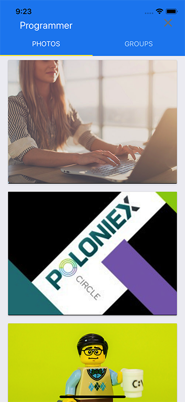

# FlickrClient

Simple React Native + Redux app as a client for flickr.com

# Run on device/simulator
`npm install`

`react-native run-android`

`react-native run-ios`
# Screenshots
    #Android

    # iOS

