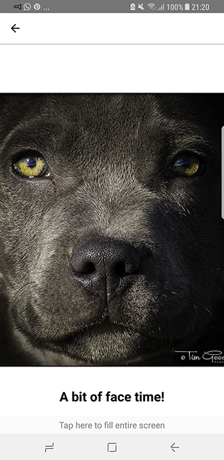

# FlickrClient

Simple React Native + Redux app using flickr.com API to retrive some photos and group info

# Run on device/simulator
`npm install`

`react-native run-android`

`react-native run-ios`
# Screenshots
    #Android

    # iOS

#Libraries

react-redux: used for storing data and decoupling ui from business logic(side effect)

react-navigation: used for creating the stack of screens and navigation between them

native-base: ui library used mostly for cards

react-native-searchbar: ui library for search bar

react-native-i18n: internationalization

axios: as HTTP client

react-native-tab-view: ui library for material design tabs
  

